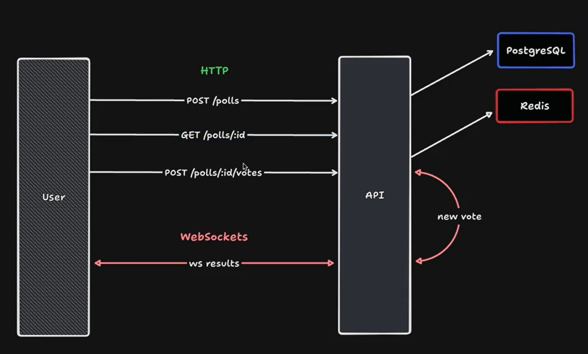

# Trilha de NodeJs NLW Expert

Este repositório contém o código desenvolvido ao longo da trilha de NodeJs NLW Expert. Durante este curso, foram abordados os seguintes tópicos:

## NLW Expert | Aula 01
É hora de começar nosso projeto! Nesta aula, montamos o setup com TypeScript, Fastify e Prisma, entendemos conceitos de API, como método HTTP e rotas, além de colocar a mão na massa para criar nossa primeira tabela utilizando Prisma.

## NLW Expert | Aula 02
A decolagem foi um sucesso e agora é hora de avançar. Nesta aula, demos sequência à criação das nossas rotas! Adicionamos as opções da votação e implementamos as rotas de buscar uma votação pelo ID e a rota para votar na opção selecionada, validando as lógicas de ação do usuário.

## NLW Expert | Aula 03
O próximo nível está cada vez mais próximo! Para finalizar nosso projeto, nesta aula, adicionamos o Redis para lidar com o cache dos votos e organizamos o ranking das opções mais votadas. Além disso, implementamos a funcionalidade de realtime utilizando websockets.

